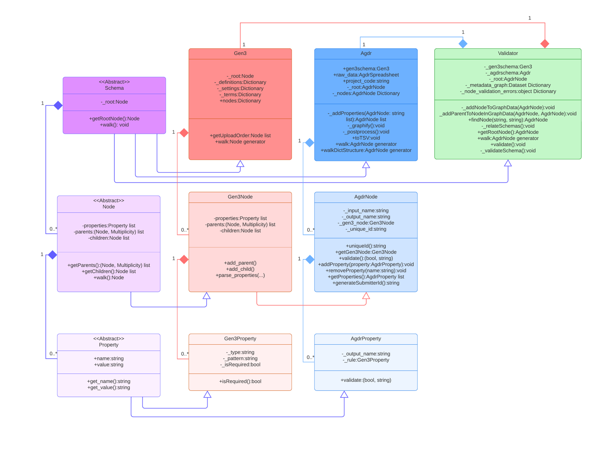

# Introduction

The **AGDR Metadata Validator** is a Python-based tool customized for the **Aotearoa Genomics Data Repository (AGDR)**. Its primary purpose is to assist with the **data ingest process** by automating the validation of metadata submitted via spreadsheet.

## Input Format

- **File type**: Spreadsheet
- The spreadsheet should follow AGDR formatting conventions, with validation rules typically specified in the **description row** beneath each field header.

## Functionality

- The validator examines the spreadsheet based on rules defined in the **AGDR metadata dictionary** and the embedded spreadsheet descriptions.
- It identifies common issues such as:
  - Format inconsistencies
  - Modified field structures
  - Invalid or missing values in the “Your Input” columns
- In addition to validation, the tool generates **TSV files** that are compatible with the AGDR metadata dictionary, streamlining the ingest process.

# Design

The broad responsibilities of the Python modules within the `agdrvalidator` are organized into several directories:

## Core Directories

- **`data/`**  
  Contains supported dictionaries so users don’t need to specify or download them from AGDR.

- **`globals/`**  
  General-purpose global configuration and utilities.
  - **`loglevel/`**: Manages logging verbosity.
  - **`version/`**: Stores the current version of the `agdrvalidator` tool. The spreadsheet version is read directly from each spreadsheet used for data ingest.

## Parser Modules

- **`dictionary/`**  
  Parses the data dictionary. Designed to work generically with any data dictionary.

- **`excel/`**  
  Parses a specific version of the AGDR metadata spreadsheet template.

## Schema and Transformation

- **`schema/`**  
  Represents the metadata dictionary as a graph structure, including rules and metadata from the spreadsheet. (See next section for details.)

- **`transformer/`**  
  Generates TSV files from a schema object.

- **`utils/`**  
  Contains helper functions for business logic.

---

## Schema Structure

The UML diagram describes the structure of the code inside the `schema/` directory.

- A **`Schema`** is an abstract base class using a composite design pattern. It is composed of **nodes**, which in turn are composed of **properties**.

### Gen3 Schema

- Represents a generic data dictionary.
- **`gen3schema.py`** defines `getUploadOrder()`, which determines a valid traversal path for the graph. It ensures child nodes are only visited after their parent nodes, enabling validation of node connectivity.
- **`gen3node.py`** contains logic for parsing nodes from a data dictionary.

### AGDR Schema

- Represents metadata from an Excel spreadsheet.
- **`agdrschema.py`** defines `_graphify()`, which maps `Gen3Nodes` and `Gen3Properties` to `AgdrNodes` and `AgdrProperties`.

> ⚠️ Note: Despite its name, `_graphify()` does not construct a graph. It populates `self._nodes`, a dictionary mapping node names to lists of node instances (e.g., `"experiment"` → list of experiment metadata).

- Several conceptual issues exist in the current AGDR schema implementation. When re-implementing for new dictionary structures:
  - Focus on replicating `_graphify()` (with a better name).
  - Reuse `walkDictStructure()` to maintain node traversal order.
  - Delegate graph generation, validation, and TSV generation to the `Validator`, not the schema.

---

## Validator

The `Validator` connects the Gen3 schema to metadata from an AGDR schema and builds one or more graph structures.

- Each experiment may have multiple samples, and each sample may have multiple processed files.
- During graph construction, the validator checks whether each node has its expected parents. Orphan nodes indicate metadata errors.

### `validator.py`

- Contains logic specific for the last version of the AGDR dictionary and spreadsheet.
- If the dictionary or spreadsheet changes, the `Validator` class may be updated.

#### Key Components

- **`Dataset`**  
  A container class for graph structures. Currently uses O(n) lookup, which may be inefficient for large metadata sets.

- **`_relateSchemas()`**  
  Walks the Gen3 schema and adds nodes from the AGDR schema. Originally added nodes one at a time, now uses bulk addition for performance.

- **`_bulkAddParentsToNodesInGraphData()`**  
  Validates schema-level connectivity. Every node (except the root) must have a parent. Orphan nodes indicate missing metadata (e.g., a sample without an experiment).

- **`_validateSchema()`**  
  - Checks for duplicate `submitter_id`s within a project.
  - Reports errors from `_bulkAddParentsToNodesInGraphData()`.
  - Calls `_report_node_properties()` to validate individual node properties.

---

## Validation Levels

There are **three levels of validation**:

### 1. Property Level
- Is the property required?
- Is the value valid?
  - Type: string, number, enum, boolean
  - Regex pattern (for strings)
  - Enum value check

### 2. Node Level
- Are all properties valid?
- Is the node an orphan?

### 3. Schema Level
- Are all nodes valid?
- Do all nodes (except the root) have parents?

---

## TSV Generation

- Called by the `toTSV()` function in `agdrschema.py`.
- Walks all nodes in the order defined by the Gen3 schema.
- Generates one TSV file per node type.
- Each file is prepended with a numeric value indicating upload order (parents before children), as required by the Gen3 data portal.

# Tips to Start with the Validator

To configure and customize the AGDR Metadata Validator for a new dictionary and spreadsheet template, follow these steps:

1. **Add the dictionary**
   - Place your new dictionary file in:  
     `github/agdr-validator/src/agdrvalidator/data/dictionaries/`

2. **Update the dictionary reference**
   - In `agdrdictionary.py` (line 10):  
     `github/agdr-validator/src/agdrvalidator/data/dictionaries/agdrdictionary.py`  
     Update the reference to point to your new dictionary.

3. **Check the dictionary parser**
   - In `gen3parser.py`:  
     `github/agdr-validator/src/agdrvalidator/parser/dictionary/gen3parser.py`  
     Review the `_openDictionary()` method. It should work as-is for standard Gen3 dictionaries.

4. **Customize the AGDR schema**
   - In `agdrschema.py`:  
     `github/agdr-validator/src/agdrvalidator/schema/agdrschema.py`  
     Define the nodes specific to your dictionary, including the default program and project nodes.

5. **Adapt the spreadsheet validator**
   - In `agdrspreadsheet_validator.py`:  
     `github/agdr-validator/src/agdrvalidator/schema/agdrspreadsheet_validator.py`  
     Customize this file to match your spreadsheet template. List all expected headers.

6. **Update unique ID logic**
   - In `validator.py`:  
     `github/agdr-validator/src/agdrvalidator/schema/validator.py`  
     Update the `getParentUniqueIdProperties()` method with the unique identifier for each node.

7. **Rewrite node parsing logic**
   - In `agdrnode.py`:  
     `github/agdr-validator/src/agdrvalidator/schema/node/agdrnode.py`  
     This file must be rewritten. Its role is to:
     - Read each attribute of each node from the dictionary.
     - Read the corresponding values from the spreadsheet.
     - Match and validate them.

8. **Review empty value handling**
   - In `agdrtsv.py`:  
     `github/agdr-validator/src/agdrvalidator/transformer/agdrtsv.py`  
     Check the list of values considered as "empty" or "no value" and update as needed.

